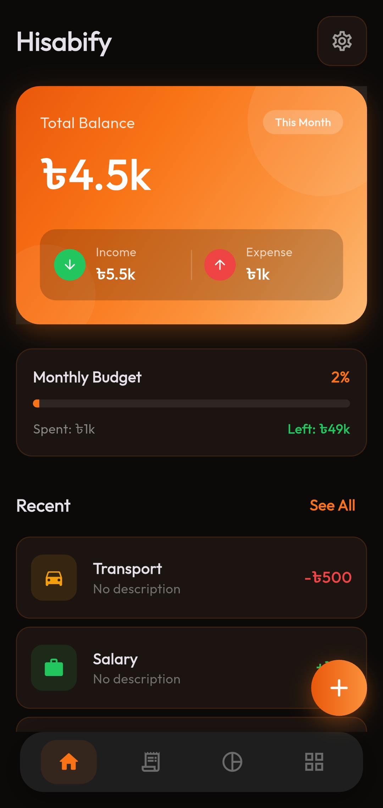
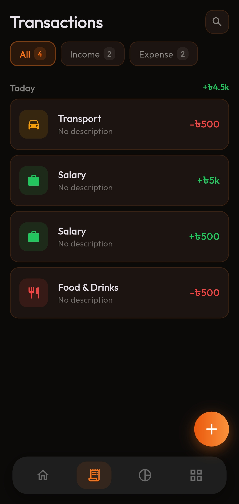
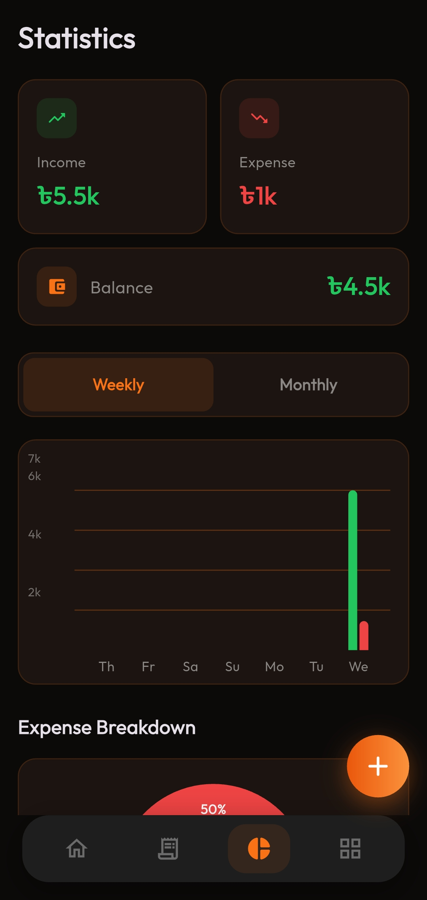
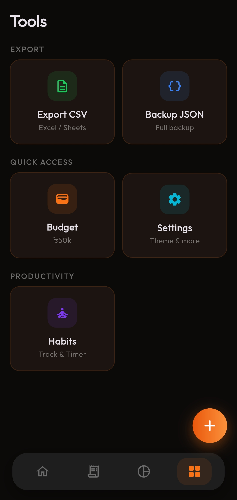
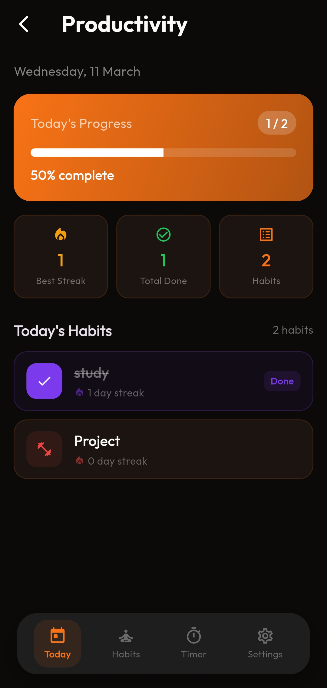
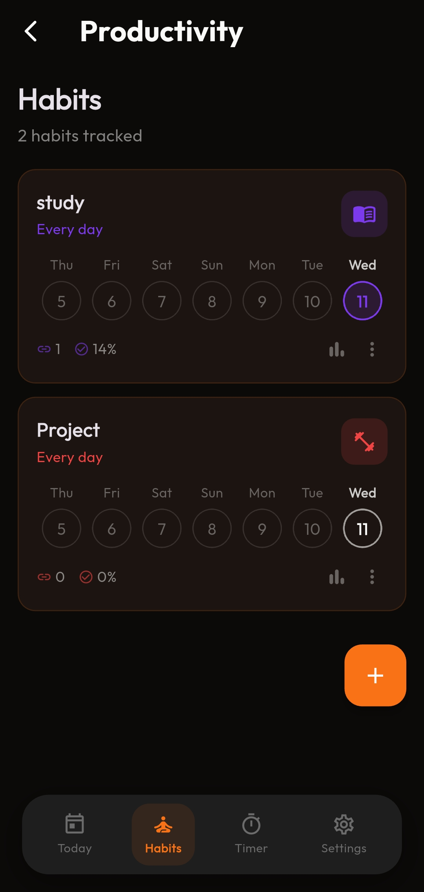
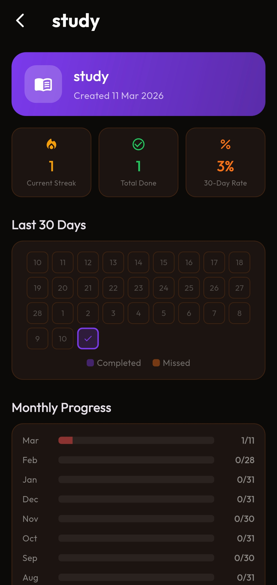
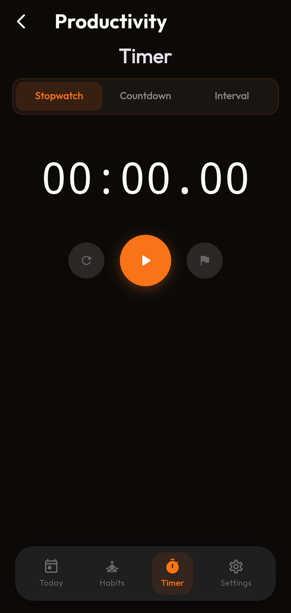
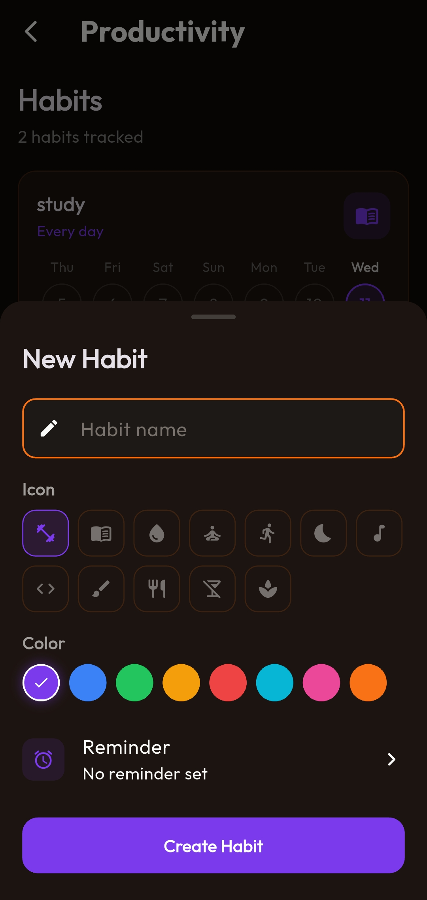

<div align="center">


# Hisabify

**Your All-in-One Finance & Productivity Companion**

[](https://flutter.dev)
[](https://dart.dev)
[](https://github.com/masudranaxpert/Hisabify/actions)
[](LICENSE)
[](https://github.com/masudranaxpert/Hisabify/pulls)

*Track expenses, build habits, manage budgets, and boost productivity — all in one beautifully designed app.*

<br>

[](https://github.com/masudranaxpert/Hisabify/releases/latest)

---

</div>

## ✨ Features

### 💰 Finance Management
| Feature | Description |
|---------|-------------|
| **Expense & Income Tracking** | Add transactions with categories, amounts, and notes |
| **Monthly Budget** | Set budgets with visual progress tracking |
| **Statistics Dashboard** | Interactive pie charts, bar charts & trend analysis |
| **Data Export** | Export your data to custom folders (CSV) |
| **Multi-Currency** | Support for BDT, USD, EUR, INR, GBP, JPY |

### ✅ Habit Tracker
| Feature | Description |
|---------|-------------|
| **Daily Habits** | Create and track daily habits with custom icons & colors |
| **Weekly Calendar** | Visual 7-day completion view on each habit card |
| **Habit Stats** | 30-day heatmap, monthly progress charts, all-time summary |
| **Streaks** | Track your current streak and total completions |
| **Smart Reminders** | Set custom reminder times with persistent notification settings |

### ⏱️ Productivity Timer
| Feature | Description |
|---------|-------------|
| **Stopwatch** | Precision timer with lap tracking |
| **Countdown** | Custom hours, minutes, seconds with circular progress |
| **Interval Timer** | Work/rest cycles with quick presets (HIIT, Swimming, Yoga, Study & more) |

### 🎨 Design & UX
- 🌙 **Dark & Light Theme** with system auto-detect
- 🎯 **Modern UI** with smooth animations & transitions
- 📱 **Responsive Design** optimized for all screen sizes
- 🔔 **Smart Notifications** for habit reminders

---

## 🛠️ Tech Stack

```
📦 Framework      →  Flutter & Dart
🔄 State Mgmt    →  Provider
📊 Charts         →  fl_chart
💾 Storage        →  SharedPreferences
🎨 Fonts          →  Google Fonts
📤 Export         →  CSV, Share Plus
📁 File System    →  Path Provider, File Picker
🔔 Notifications  →  flutter_local_notifications
⏰ Timezone       →  timezone, flutter_timezone
```

---

## 🚀 Getting Started

### Prerequisites
- Flutter SDK `^3.11.1`
- Dart SDK `^3.11.1`
- Android Studio / VS Code

### Installation

```bash
# Clone the repository
git clone https://github.com/masudranaxpert/Hisabify.git

# Navigate to project
cd Hisabify

# Install dependencies
flutter pub get

# Run the app
flutter run
```

### Build APK

```bash
flutter build apk --release --no-tree-shake-icons
```

> 📍 APK output: `build/app/outputs/flutter-apk/app-release.apk`

---

## 📂 Project Structure

```
lib/
├── core/
│   ├── services/          # Notification & Export services
│   └── theme/             # App theme (dark/light)
├── habits/
│   ├── models/            # Habit data model
│   ├── providers/         # Habits state management
│   ├── screens/           # Today, Habits, Timer, Settings
│   └── widgets/           # HabitCard, HabitTile, DayCircle
├── providers/
│   ├── expense_provider.dart
│   └── theme_provider.dart
├── screens/
│   ├── home_screen.dart
│   ├── transactions_screen.dart
│   ├── stats_screen.dart
│   ├── budget_screen.dart
│   ├── settings_screen.dart
│   └── tools_screen.dart
├── widgets/               # Reusable UI components
└── main.dart
```

---

## 📸 Screenshots

<div align="center">
<table>
  <tr>
    <td></td>
    <td></td>
    <td></td>
  </tr>
  <tr>
    <td></td>
    <td></td>
    <td></td>
  </tr>
  <tr>
    <td></td>
    <td></td>
    <td></td>
  </tr>
</table>
</div>

---

## 🤝 Contributing

Contributions are welcome! Feel free to:

1. **Fork** the repository
2. **Create** a feature branch (`git checkout -b feature/amazing-feature`)
3. **Commit** your changes (`git commit -m 'Add amazing feature'`)
4. **Push** to the branch (`git push origin feature/amazing-feature`)
5. **Open** a Pull Request

---

## 📄 License

This project is open source and available under the [MIT License](LICENSE).

---

<div align="center">

**Made with ❤️ by [Masud Rana](https://github.com/masudranaxpert)**

⭐ Star this repo if you find it useful!

</div>
